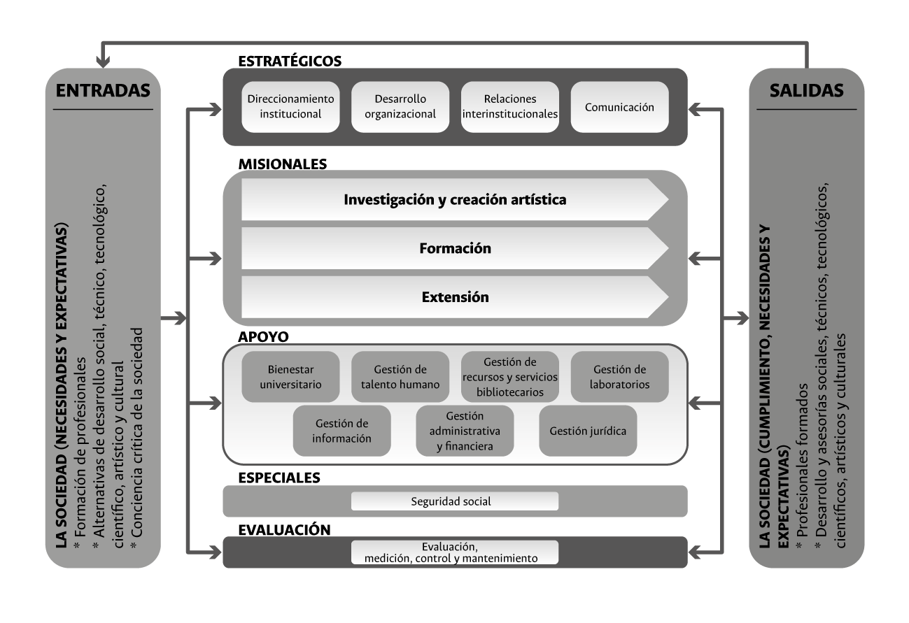

# Gestión por procesos {#procesos}

El *mapa de macroprocesos de la Universidad*, como se ilustra en la figura \@ref(fig:fig2), está conformado por 16 macroprocesos.

```{r fig2, fig.align='center', out.width='80%', fig.show='hold', fig.cap='Mapa de procesos institucionales. Tomado de Gestión por procesos en http://siga.unal.edu.co/index.php/procesos/gestion-por-procesos1.',echo=FALSE}



```