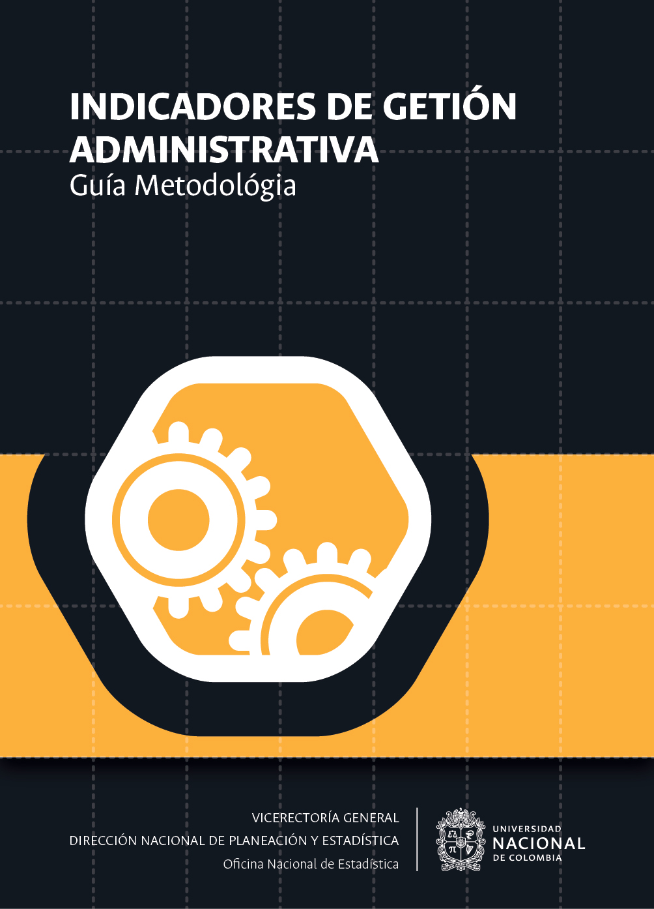
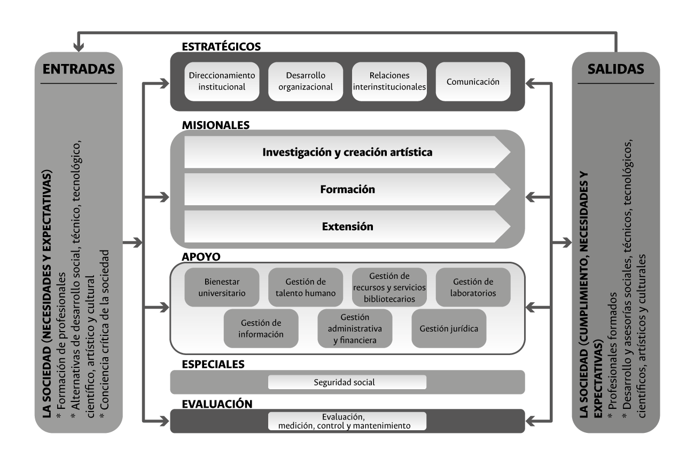

--- 
title: "Indicadores de gestión por procesos"
subtitle: "Guía Metodológica"
author: "<a href='http://estadisticas.unal.edu.co/' target='blank'> Oficina Nacional de Estadística</a> </br> <a href='http://siga.unal.edu.co/' target='blank'> Sistema Integrado de Gestión - SIGA</a>" 
#date: "`r format(Sys.Date(), 'Año %Y')`"
date: "Versión 1.0"
site: bookdown::bookdown_site
output: bookdown::gitbook
documentclass: book
bibliography: [book.bib, packages.bib]
biblio-style: apalike
link-citations: yes
---

# Portada {-}


```{r fig.align='center', out.width='75%', fig.show='hold', echo=FALSE}

```


<!--chapter:end:index.Rmd-->

# Introducción {- #intro}

El Capítulo \@ref(procesos), titulado _Gestión por procesos_, 

<!--chapter:end:01-Introducción.Rmd-->

# Gestión por procesos {#procesos}

El *mapa de macroprocesos de la Universidad*, como se ilustra en la Figura \@ref(fig:fig2), está conformado por 16 macroprocesos.

```{r fig2, fig.align='center', out.width='80%', fig.show='hold', fig.cap='Mapa de procesos institucionales. Tomado de Gestión por procesos en http://siga.unal.edu.co/index.php/procesos/gestion-por-procesos1.',echo=FALSE}



```

<!--chapter:end:02-Procesos.Rmd-->

# Seguimiento y medición {#medicion}

Seguimiento, medición, análisis y evaluación

## Alcance


<!--chapter:end:03-Seguimiento.Rmd-->

# Tipos de medidas {#medidas}

Existen tres tipos de medidas

## Estadísticas

Como lo presenta @Alberto2019, las estadísticas^[Nombre que se emplea para diferenciarlo de ...] 

## Indicadores estadísticos
## Indicadores de cumplimiento


<!--chapter:end:04-Medidas.Rmd-->

# Medición de los procesos en la UN {#indicadoresUN}

## Principios
## Gobernabilidad
## Un proceso especial

<!--chapter:end:05-MedicionUN.Rmd-->

# Anexos {-}

<!--chapter:end:06-Anexos.Rmd-->

`r if (knitr::is_html_output()) '
# Referencias {-}
'`

<!--chapter:end:07-Referencias.Rmd-->

