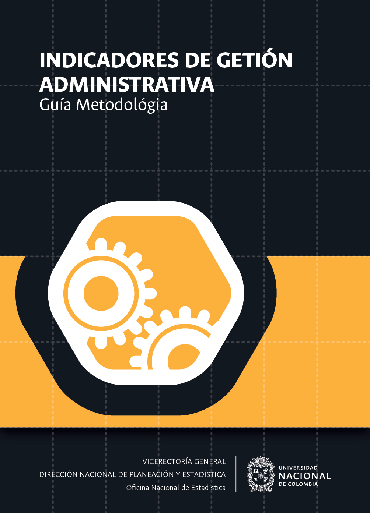

--- 
title: "Indicadores de gestión por procesos"
subtitle: "Guía Metodológica"
author: "<a href='http://estadisticas.unal.edu.co/' target='blank'> Oficina Nacional de Estadística</a> </br> <a href='http://siga.unal.edu.co/' target='blank'> Sistema Integrado de Gestión - SIGA</a>" 
#date: "`r format(Sys.Date(), 'Año %Y')`"
date: "Versión 1.0"
site: bookdown::bookdown_site
output: bookdown::gitbook
documentclass: book
bibliography: [book.bib, packages.bib]
biblio-style: apalike
link-citations: yes
---

# Portada {-}


```{r fig.align='center', out.width='75%', fig.show='hold', echo=FALSE}

```

<a rel="license" href="http://creativecommons.org/licenses/by-nc-nd/4.0/"></a><br />Esta guía ha sido publicada por la Universidad Nacional de Colombia. La versión en línea de este documento está disponible bajo la licencia <a rel="license" href="http://creativecommons.org/licenses/by-nc-nd/4.0/">Creative Commons Attribution-NonCommercial-NoDerivatives 4.0 International</a>.
